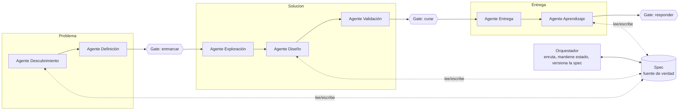
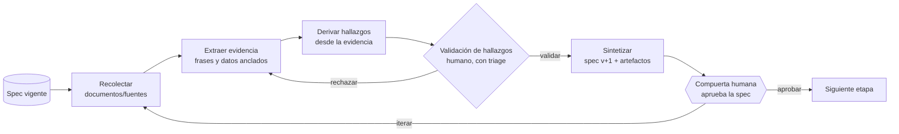

# PRD — Product Designer Agéntico

### Sistema orquestado de agentes para el proceso E2E de diseño de producto, bajo metodología Spec-Driven

|                           |                                                                             |
| ------------------------- | --------------------------------------------------------------------------- |
| **Versión del documento** | v0.2 (incorpora evidencia anclada y hallazgos como objeto de primera clase) |
| **Estado**                | Draft                                                                       |
| **Entorno de build**      | Claude Code                                                                 |
| **Metodología**           | Spec-Driven Development (SDD)                                               |
| **Codename**              | _(por definir)_                                                             |

> **Cómo usar este PRD.** Es un documento vivo y deliberadamente desechable en sus detalles: el esquema de la spec y el contrato del Agente 1 se van a revisar apenas el Agente 1 empiece a producir output real. Trátalo como andamio, no como compromiso. Está escrito para arrancar en Claude Code y para alinear a interlocutores técnicos y no técnicos.

---

## Tabla de contenido

1. Resumen ejecutivo
2. Contexto y problema
3. Objetivos y métricas de éxito
4. Log de decisiones (qué decidimos y por qué)
5. Principios rectores
6. Arquitectura del sistema
7. La spec (esquema y ciclo de vida)
8. El contrato del agente de etapa (el ladrillo reusable)
9. El orquestador
10. Agente 1 — Descubrimiento (detallado)
11. Las compuertas humanas
12. Conectores, fuentes y design system
13. Skills
14. El dashboard (cabina de producción vs cabina de demo)
15. Fases de desarrollo (roadmap)
16. Stack técnico sugerido
17. Riesgos y mitigaciones
18. Fuera de alcance (v0)
19. Glosario
20. Próximos pasos y preguntas abiertas

---

## 1. Resumen ejecutivo

Construir un **Product Designer Agéntico**: un orquestador que coordina agentes especializados, uno por etapa, capaz de recorrer el proceso end-to-end de diseño de producto (7 etapas) bajo metodología Spec-Driven. El sistema no reemplaza al diseñador: ejecuta una **spec** —el contrato de qué y por qué— que un humano posee y aprueba en compuertas explícitas. Se expone como un dashboard web centrado en la spec, donde lo que el humano ve y aprueba es la evolución de esa especificación, no una botonera de agentes.

El primer entregable es un _vertical slice_: el Agente 1 (Descubrimiento) corriendo de verdad, el orquestador mínimo, y la primera compuerta humana (enmarcar), todo vestido en el dashboard, con las demás etapas mockeadas. Sirve para dos cosas a la vez: validar el motor y demostrar la visión a jefaturas no técnicas.

---

## 2. Contexto y problema

El diseño de producto E2E tiene 7 etapas (Descubrimiento → Definición → Exploración → Diseño → Validación → Entrega → Aprendizaje). La IA abarata radicalmente la producción dentro de cada etapa, pero el juicio para enmarcar el problema, curar entre opciones y responder por el envío sigue siendo humano e irreductible —especialmente en un entorno regulado, donde alguien tiene que rendir cuentas por la decisión—.

El patrón ingenuo ("metê todo en el prompt", o "un agente que hace todo") falla por dos razones conocidas: se degrada el contexto en cadenas largas, y se pierde la trazabilidad de por qué se tomó cada decisión. Spec-Driven Development ataca ambas: la especificación deja de ser documentación que se archiva y se vuelve un contrato versionado del que los agentes derivan su trabajo y que actualizan a medida que avanzan. Las specs persisten entre sesiones y entre agentes, y dejan un rastro de auditoría —que es exactamente lo que un entorno regulado exige antes de aprobar algo generado por IA—.

**El problema de negocio inmediato:** convencer a jefaturas no técnicas de la viabilidad y el valor. Una terminal con un agente corriendo no comunica; un dashboard que muestra el viaje de una decisión atravesando la spec con su compuerta humana, sí.

---

## 3. Objetivos y métricas de éxito

### Objetivo del sistema

Recorrer el proceso E2E de diseño con agentes especializados, manteniendo a un humano como dueño de las decisiones clave y un rastro de auditoría completo.

### Objetivo del primer hito (vertical slice / demo)

Demostrar, de punta a punta, **el viaje de una decisión**: el Agente 1 produce una versión de la spec a partir de fuentes reales, y un humano la aprueba en la compuerta de enmarcado, todo visible en el dashboard.

### Métricas de éxito

| Tipo            | Métrica                                                                  | Objetivo                              |
| --------------- | ------------------------------------------------------------------------ | ------------------------------------- |
| Producto (demo) | Una decisión viaja Descubrimiento → spec v1 → gate enmarcar, demostrable | Sí / No                               |
| Producto (demo) | Tiempo de la jefatura para "entender la visión"                          | < 2 min de demo                       |
| Eficiencia      | Reducción de tiempo en síntesis de research vs proceso manual            | medir baseline primero                |
| Control         | % de saltos de versión de la spec que pasaron por una compuerta humana   | 100%                                  |
| Control         | % de acciones de agentes registradas en el log de auditoría              | 100%                                  |
| Calidad         | Criterios de verificación de la spec cumplidos antes de cada gate        | 100% de los marcados como bloqueantes |

> Nota: las métricas de eficiencia exigen medir un baseline manual antes de declarar mejoras. No se reportan ganancias sin línea base.

---

## 4. Log de decisiones (qué decidimos y por qué)

Estas decisiones vienen del diseño previo del sistema y son el punto de partida; cada una es revisable.

| #   | Decisión                                                                                                       | Razón                                                                                          |
| --- | -------------------------------------------------------------------------------------------------------------- | ---------------------------------------------------------------------------------------------- |
| D1  | Orquestador + agentes de etapa especializados (no un agente monolítico)                                        | Construible 1-a-1; especialización por etapa; aísla fallos                                     |
| D2  | Metodología Spec-Driven: la spec es la fuente de verdad única, versionada                                      | Evita "vibe-designing"; persiste contexto; da trazabilidad/auditoría                           |
| D3  | Las 3 compuertas humanas (enmarcar, curar, responder) son human-led e irreductibles                            | Es juicio/accountability, no tarea; "responder" es la decisión regulatoria                     |
| D4  | Dashboard **centrado en la spec**, no lanzador de agentes                                                      | Mantiene la disciplina spec-driven; el agente propone, el humano aprueba                       |
| D5  | Taxonomía de 4 modos por etapa: human-led / se potencia / se reduce / 100% automatizable                       | Clasifica qué delega el sistema y qué se queda el humano                                       |
| D6  | Producción: motor antes que cabina. Demo: vertical slice (Agente 1 real + resto mockeado)                      | El motor da valor verificable; la demo comunica la visión                                      |
| D7  | Dos pistas separadas: cabina de producción vs cabina de demo (desechable)                                      | Evita que la demo se vuelva producción por inercia                                             |
| D8  | El esquema de la spec es el build #0, compartido por ambas pistas                                              | Es lo único que de verdad comparten producción y demo                                          |
| D9  | La config de conectores/fuentes es **gobernanza**, no UX; se difiere                                           | Cada conector es superficie de seguridad; en banca es control de acceso                        |
| D10 | El design system juega 3 roles: restricción + fuente + validador                                               | No es "una fuente más"; sub-usarlo pierde los chequeos automatizables                          |
| D11 | Skills = metodología empaquetada (distinta de conectores y de la spec)                                         | Skill = cómo; conector = datos; spec = contrato                                                |
| D12 | Construir las skills críticas propias; vetar y forkear las de terceros                                         | Seguridad: una skill trae scripts ejecutables; no se instala marketplace en entorno regulado   |
| D13 | El esquema de la spec v0 es desechable; se co-diseña con el Agente 1                                           | Esperar un loop de vuelta cuando el agente enseñe qué produce de verdad                        |
| D14 | Agente 1 = Descubrimiento, llegando hasta la compuerta enmarcar                                                | Front del proceso, fuentes disponibles, cierra una narrativa completa para la demo             |
| D15 | Orden anti-alucinación: **anclar primero, sintetizar después** (extraer evidencia → derivar hallazgos)         | Sintetizar primero hace que el agente back-fillee citas para conclusiones ya escritas          |
| D16 | Lo cuantitativo se **computa de forma determinística** (script sobre filas), no lo resume el LLM               | Evita números inventados y el techo de contexto en archivos grandes                            |
| D17 | El **hallazgo** es objeto de primera clase en la spec, con evidencia anclada a fuente + locator + cita/cálculo | Auditabilidad y resistencia a la alucinación por construcción                                  |
| D18 | Validación humana en **dos niveles**: micro (hallazgos, con triage por confianza) y macro (la compuerta)       | Evitar fatiga de aprobación; validar 80 hallazgos uno por uno sería peor que el proceso manual |
| D19 | **Procedencia heredada** en las 7 etapas: toda afirmación referencia su fuente                                 | El mismo invariante recorre todo el pipeline, no solo Descubrimiento                           |
| D20 | Fase 1 sin MCP: fuentes = **archivos** (txt, xlsx, csv, pdf)                                                   | Difiere toda la gobernanza de conectores; deja construir el Agente 1 sin OAuth                 |

---

## 5. Principios rectores

1. **La spec es el centro.** Todo gira alrededor de la spec viva. Los agentes proponen cambios; los humanos los aprueban.
2. **El agente no decide, propone.** Las convergencias (gates) son humanas. Si automatizas un gate, dejaste de tener Spec-Driven.
3. **La spec antes que el output.** No se genera nada sin que la spec lo restrinja. Generar barato no es licencia para generar sin contrato.
4. **Construir 1-a-1, gate por gate.** No se construye la etapa N+1 hasta que la compuerta de la etapa N funciona.
5. **Motor antes que cabina** (para producción). La UI se pone encima de un loop que ya cierra.
6. **Todo se audita.** Cada acción de agente y cada aprobación queda en el log. Trazabilidad por defecto.
7. **El humano es dueño de la accountability.** El sistema acelera; no asume responsabilidad regulatoria.
8. **Andamio sobre compromiso.** El esquema v0 y los contratos son desechables hasta que el uso real los valide.
9. **Toda afirmación cita su fuente.** Ningún hallazgo, decisión ni output existe sin la frase o el dato exacto que lo sustenta. Un hallazgo sin fuente es una bandera roja, no un hallazgo.

---

## 6. Arquitectura del sistema

### Capas (no confundir)

- **Spec** — el contrato (qué y por qué). Fuente de verdad única, versionada.
- **Conectores / MCP** — acceso a datos y acciones (las manos): Confluence, Figma, GitHub, analítica, Jira.
- **Skills** — el cómo: metodología empaquetada que el agente carga bajo demanda (SKILL.md + scripts/plantillas).
- **Modelo** — el razonamiento.

Un agente de etapa = modelo + las skills de su etapa + los conectores de su etapa, operando sobre la spec.

### Vista de orquestación



### Las 7 etapas, 3 diamantes, 3 compuertas, 4 modos

| Etapa             | Diamante | Modo dominante            | Compuerta al cierre                       |
| ----------------- | -------- | ------------------------- | ----------------------------------------- |
| 1. Descubrimiento | Problema | se potencia               |                                           |
| 2. Definición     | Problema | se potencia               | **enmarcar** (human-led)                  |
| 3. Exploración    | Solución | se reduce                 |                                           |
| 4. Diseño         | Solución | se reduce + automatizable |                                           |
| 5. Validación     | Solución | mixto                     | **curar** (human-led)                     |
| 6. Entrega        | Entrega  | automatizable             |                                           |
| 7. Aprendizaje    | Entrega  | se potencia               | **responder** (human-led, accountability) |

Las tres compuertas son las únicas casillas human-led por diseño. "Responder" requiere control de acceso porque es la decisión de envío con implicancias regulatorias.

---

## 7. La spec (esquema y ciclo de vida)

La spec define seis elementos: **outcomes, alcance, restricciones, decisiones previas, desglose de tareas y criterios de verificación**. No es estática: arranca mínima en Descubrimiento y se enriquece en cada paso. La spec de la etapa N es la entrada de la etapa N+1.

A partir de v0.2, la spec incorpora una capa intermedia de **hallazgos** (`findings`): la capa entre los documentos crudos y la spec. Un hallazgo nace anclado a su evidencia, se valida, y al validarse se **promueve** a `outcomes`, `constraints` o hipótesis. Esto materializa el principio de procedencia (§5.9) en el esquema.

### Esquema v0 (desechable, para iterar)

```yaml
spec:
  id: string
  title: string
  version: int # se incrementa solo al aprobar una compuerta
  status: draft | in_review | approved | superseded
  current_stage: descubrimiento | definicion | exploracion | diseno | validacion | entrega | aprendizaje

  # 1. Outcomes — qué éxito y cómo se mide
  outcomes:
    - metric: string
      baseline: string | null
      target: string
      method: string # p. ej. HEART / Goals-Signals-Metrics

  # 2. Alcance — qué entra y, crítico, qué NO
  scope:
    in_scope: [string]
    non_goals: [string]

  # 3. Restricciones
  constraints:
    regulatory: [string] # p. ej. cumplimiento del regulador que aplique (CMF en Chile)
    accessibility: string # p. ej. WCAG 2.2 AA
    design_system:
      name: string
      version: string
      link: string
    technical: [string]

  # 4. Decisiones previas (con rationale)
  decisions:
    - id: string
      date: date
      decision: string
      rationale: string
      author: string # humano o agente
      supersedes: string | null

  # 5. Desglose de tareas
  tasks:
    - id: string
      description: string
      stage: string
      owner: agent | human
      status: todo | in_progress | done | blocked

  # 6. Criterios de verificación
  verification:
    - criterion: string
      type: automated | human
      blocking: bool
      status: pending | pass | fail
      evidence: string | null

  # 7. Hallazgos (capa entre documentos crudos y spec)
  findings: [finding] # ver objeto finding abajo

  # Procedencia / auditoría
  history:
    - version: int
      stage: string
      proposed_by: string # agente o humano
      change_summary: string
      approved_by: string | null # humano que aprobó la compuerta
      timestamp: datetime
```

### El objeto `finding` (objeto de primera clase)

Cada hallazgo nace anclado a su evidencia. La regla de oro: la evidencia se **extrae primero** desde los documentos, y el `statement` se **deriva desde la evidencia** —nunca al revés—.

```yaml
finding:
  id: F-001
  statement: "Los usuarios abandonan en el paso de verificación OTP"
  type: qualitative | quantitative
  evidence:
    - source: "entrevista_07.pdf"
      locator: "p.3, párrafo 2"
      quote: "me cansé de esperar el código y cerré la app" # cita textual (cualitativo)
    - source: "abandono.csv"
      locator: "hoja 'funnel', filas 40-128"
      computation: "drop-off OTP = 38% (n=312)" # dato COMPUTADO, no estimado
  confidence: high | medium | low
  status: proposed | validated | rejected
  feeds: outcomes | constraints | hypothesis | scope # a qué parte de la spec se promueve
  reviewed_by: string | null
  review_note: string | null # si se rechaza, por qué (entra como input si el agente re-itera)
```

Reglas del objeto:

- Un hallazgo `quantitative` exige al menos una `evidence` con `computation` (cálculo determinístico sobre filas), no un número estimado por el modelo.
- Un hallazgo `qualitative` exige al menos una `evidence` con `quote` textual + `locator`.
- Un hallazgo sin `evidence` es inválido: no se promueve ni se muestra como hallazgo.
- Al validarse (`status: validated`), el hallazgo se promueve a la sección que indica `feeds`.

### Ciclo de vida

1. El orquestador entrega la spec vigente al agente de etapa.
2. El agente propone una **spec v+1** (un diff) + artefactos.
3. Se corren los criterios de verificación automatizables.
4. En las etapas con compuerta, un humano aprueba (sube la versión) o pide iterar.
5. El historial registra todo.

### Decisión de almacenamiento (recomendada)

Guardar la spec como **markdown/YAML versionado en git**. Regala diff, historial y auditoría —que es justo lo que SDD y el entorno regulado piden— sin construir infraestructura nueva.

---

## 8. El contrato del agente de etapa (el ladrillo reusable)

Todos los agentes comparten la misma anatomía. Por eso se construyen 1-a-1 y el sistema crece sin rediseñarse.



### Interfaz (contrato)

```
StageAgent:
  input:
    - spec: la versión vigente (contrato de entrada)
    - stage_config: { sources[], skills[], design_system_ref }   # sources = archivos o conectores
  steps:
    - recolectar:  ingiere los documentos/fuentes de la etapa (archivos o conectores)
    - extraer:     extrae evidencia anclada (frases + locator; o cálculo sobre datos) ANTES de concluir
    - derivar:     deriva hallazgos DESDE la evidencia extraída (nunca al revés)
    - validar:     validación humana de hallazgos con triage por confianza (loop interno)
    - sintetizar:  promueve los hallazgos validados a la spec y produce los artefactos de la etapa
  output:
    - spec_proposal: diff de la spec (v -> v+1), con findings promovidos
    - artifacts: [archivos producidos]   # síntesis, flows, mockups, specs de handoff...
    - verification_results: [{criterion, status, evidence}]
  handoff:
    - human_gate (solo en etapas con compuerta): approve | iterate(feedback)
  invariantes:
    - la evidencia se extrae ANTES de derivar el hallazgo (anti back-fill de citas)
    - lo cuantitativo se COMPUTA de forma determinística, no se estima leyendo el archivo
    - NINGÚN hallazgo/output existe sin su fuente anclada (frase o dato exacto)
    - NUNCA sube de versión sin aprobación humana en su compuerta
    - TODA acción y todo rechazo de hallazgo queda en el log (quién, por qué)
```

Lo único que cambia entre etapas: las fuentes, las skills y los artefactos producidos. El contrato (recolectar → extraer → derivar → validar → sintetizar → gate) y el invariante de procedencia no cambian. En etapas posteriores, la "evidencia" cambia de forma —una decisión de Diseño cita la `constraint` de la spec que satisface; un resultado de Validación cita la data del test— pero la disciplina es la misma.

---

## 9. El orquestador

**Responsabilidad:** enrutar, no diseñar. Es el patrón Coordinator/Implementor/Verifier de SDD: coordinador = orquestador; implementadores = agentes de etapa; verificador = chequeos automáticos + compuerta humana.

Funciones:

- Mantener el **estado**: en qué etapa/versión está la spec, qué está pendiente de compuerta, qué falló.
- **Entregar** la spec vigente al agente que corresponde y **recibir** la propuesta + artefactos.
- **Disparar** los criterios de verificación automatizables.
- **Llevar a la compuerta** y bloquear el avance hasta que un humano apruebe.
- **Registrar** todo en el log de auditoría.

Lo que el orquestador NO hace: tomar decisiones de diseño, ni saltarse compuertas, ni inventar fuentes.

> En v0, el orquestador es mínimo: un proceso/script que gestiona el estado de la spec y el routing de una sola etapa. No multi-agente paralelo todavía.

---

## 10. Agente 1 — Descubrimiento (detallado)

**Propósito:** convertir documentos crudos en hallazgos anclados a su fuente, validados por el humano, y promoverlos a la primera versión sustantiva de la spec.

| Campo                         | Detalle                                                                                                                                                                                                                                                        |
| ----------------------------- | -------------------------------------------------------------------------------------------------------------------------------------------------------------------------------------------------------------------------------------------------------------- |
| **Modo dominante**            | se potencia (la IA amplifica el alcance del humano)                                                                                                                                                                                                            |
| **Entrada**                   | spec v0 (mínima: título, objetivo inicial, alcance tentativo)                                                                                                                                                                                                  |
| **Fuentes (Fase 1, sin MCP)** | **archivos**: txt, pdf, xlsx, csv (transcripciones, research previo, exports de analítica, tickets)                                                                                                                                                            |
| **Skills**                    | extracción de evidencia, síntesis de research (análisis temático/de afinidad), cómputo determinístico sobre tabular. _(Construir la principal; ver §13)_                                                                                                       |
| **Sub-pasos**                 | 1) recolectar archivos → 2) extraer evidencia (frases + locator de pdf/txt; celdas/rangos de xlsx/csv) → 3) computar lo cuantitativo con scripts → 4) derivar hallazgos desde la evidencia → 5) validación humana con triage → 6) promover validados a la spec |
| **Genera (outputs)**          | lista de `findings` anclados, clusters de temas, hipótesis priorizadas, primer borrador de problem statement                                                                                                                                                   |
| **Escribe en la spec**        | promueve hallazgos validados a `outcomes` (tentativos), `scope`, `constraints` e hipótesis (`tasks`)                                                                                                                                                           |
| **Criterios de verificación** | todo hallazgo tiene evidencia anclada; lo cuantitativo está computado, no estimado; no hay afirmaciones sin fuente                                                                                                                                             |
| **Compuerta**                 | alimenta hacia **enmarcar** (tras una pasada ligera de Definición)                                                                                                                                                                                             |
| **Qué aprueba el humano**     | en el gate: que el problema enmarcado es el correcto. (La validación de hallazgos ocurre antes, en el loop interno.)                                                                                                                                           |

### Manejo de archivos (Fase 1)

- **PDF / TXT** → evidencia = cita textual + `locator` (página, párrafo).
- **XLSX / CSV** → evidencia = referencia a celda/rango/columna + un `computation` (cálculo sobre filas). Los porcentajes y agregados se **computan con un script**, no se le piden al modelo leyendo el archivo. Esto evita números inventados y el techo de contexto en archivos grandes.
- Archivos grandes se trocean por hoja/segmento; lo cuantitativo se pre-agrega fuera del prompt.

### Validación de hallazgos (triage, para evitar fatiga)

- La validación de hallazgos es parte del **loop interno** del agente, no de la compuerta.
- Triage por confianza: aprobar en lote los `high confidence`; concentrar la atención humana en los `low` y en los de alto impacto.
- Un hallazgo rechazado queda en el log (quién, por qué); el motivo entra como input si el agente re-itera. No se borra en silencio.
- La compuerta **enmarcar** aprueba la _spec sintetizada_ resultante; los hallazgos validados la alimentan, no la reemplazan.

> Para cerrar un viaje de decisión completo en la demo, el primer hito incluye una pasada **ligera de Definición** (problem statement + métricas de éxito) suficiente para llegar a la compuerta enmarcar. La Definición completa es un fast-follow (Fase 2).

---

## 11. Las compuertas humanas

| Compuerta     | Tras la etapa       | Qué se aprueba                         | Control de acceso              |
| ------------- | ------------------- | -------------------------------------- | ------------------------------ |
| **enmarcar**  | Definición          | El problema correcto está enmarcado    | Rol: lead de diseño / PM       |
| **curar**     | Validación          | La solución elegida es la correcta     | Rol: lead de diseño            |
| **responder** | Entrega/Aprendizaje | El envío es seguro y cumple regulación | Rol: con autoridad regulatoria |

Modelo de compuerta:

- **Aprobar** → la spec sube de versión; el orquestador avanza.
- **Iterar** → el agente re-corre con el feedback como input adicional.
- Toda aprobación registra **quién**, **qué versión**, **cuándo** en `spec.history`.

La compuerta "responder" no la aprueba cualquiera: es la decisión de envío con implicancias regulatorias y necesita control de acceso real. Esto es requisito, no detalle.

### Dos niveles de validación humana (no confundir)

- **Micro — validación de hallazgos:** ocurre _dentro_ del loop del agente (curar la lista de hallazgos). Con triage por confianza para evitar fatiga: lote para los `high confidence`, atención humana en los `low` y de alto impacto.
- **Macro — la compuerta:** aprueba la _spec sintetizada_ resultante (enmarcar, curar, responder).

Los hallazgos validados **alimentan** la compuerta; no la reemplazan. Si el humano tuviera que aprobar 80 hallazgos uno por uno como si fueran compuertas, el sistema sería peor que el proceso manual.

---

## 12. Conectores, fuentes y design system

### Conectores (registro con alcance por etapa)

No es "un MCP por etapa" en silos rígidos. Es un **registro de conectores**, cada uno con alcance de qué etapas pueden usarlo. Confluence cruza todas; Analytics solo Descubrimiento; Figma/GitHub sobre todo Diseño/Entrega.

### Gobernanza (no es UX)

- Cada conector es superficie de seguridad: quién autorizó que lea qué, con qué alcance.
- **OAuth por usuario.** El sistema no ingresa credenciales por terceros.
- Toda conexión queda auditada.

### Design system — los 3 roles

1. **Restricción** en la spec (el agente diseña dentro de él).
2. **Fuente** que el agente de Diseño lee (componentes, tokens).
3. **Validador** contra el que se chequea el output (chequeos automatizables: contraste, uso de tokens).

---

## 13. Skills

**Skill = metodología empaquetada** (cómo se hace algo), distinta del conector (datos) y de la spec (contrato). Carpeta con `SKILL.md` + scripts/plantillas, cargada bajo demanda (revelación progresiva: solo nombre+descripción en contexto hasta que se necesita).

| Etapa          | Skills                                                                         | Reutilizar o construir                      |
| -------------- | ------------------------------------------------------------------------------ | ------------------------------------------- |
| Descubrimiento | síntesis de research, análisis temático, encuestas                             | construir la principal (lee tus fuentes)    |
| Definición     | JTBD, problem-framing, PRD, métricas (HEART/GSM)                               | reutilizar como scaffold                    |
| Exploración    | ideación divergente, wireframes lo-fi                                          | reutilizar parcial                          |
| Diseño         | UI consciente del design system, estados/edge-cases, UX writing, accesibilidad | **construir** (depende de TU design system) |
| Validación     | planes de usabilidad, SUS/SEQ, prototipos                                      | reutilizar                                  |
| Entrega        | handoff-spec, redlines, design-QA, auditoría a11y                              | reutilizar                                  |
| Aprendizaje    | lectura de métricas, readout post-launch                                       | construir                                   |
| Transversal    | documentos (pptx/xlsx/docx/pdf), skill-creator                                 | usar oficiales                              |

**Seguridad (no negociable):** una skill trae scripts ejecutables. No se hace `install` de una skill de marketplace apuntándola a datos de clientes. Se veta, se forkea, se internaliza en el repo y se revisa como cualquier dependencia.

---

## 14. El dashboard (cabina de producción vs cabina de demo)

### Principio

**Centrado en la spec, no lanzador de agentes.** El objeto principal de la pantalla es la spec viva; los agentes proponen cambios; las compuertas son aprobar/iterar sobre esos cambios; la config queda secundaria.

### Tres superficies

1. **La spec** (centro): el documento vivo, versionado, con la propuesta pendiente resaltada.
2. **Pipeline / estado**: las etapas con su estado, lo pendiente de compuerta, el log de auditoría.
3. **Config / setup** (secundaria): conectores, fuentes, design system, control de acceso.

### Dos pistas, dos propósitos

- **Cabina de producción**: la real. Se construye motor-primero. Es la del roadmap.
- **Cabina de demo**: desechable, para convencer jefaturas. **Vertical slice**: Agente 1 real + resto mockeado. Su único trabajo es contar **el viaje de una decisión** atravesando la spec y su compuerta, gritando dos cosas: **velocidad** (lo que tomaba semanas, comprimido) y **control** (el humano aprueba, queda auditoría). La compuerta se dramatiza como feature, no se esconde.

> Regla de higiene: no dejar que la demo se convierta en producción por inercia. Etiquetar siempre qué es real y qué está mockeado, también frente a la jefatura.

---

## 15. Fases de desarrollo (roadmap)

Cada fase tiene alcance, entregable y criterio de salida. Se construye 1-a-1; no se avanza sin que la compuerta de la fase anterior funcione.

### Fase 0 — Fundaciones

- **Alcance:** esquema de la spec (§7), estructura del repo, almacén de spec versionado (git), esqueleto del dashboard (visor de spec + componente de compuerta, etapas mockeadas).
- **Entregable:** se puede crear, ver y versionar una spec; el shell renderiza un pipeline mockeado.
- **Salida:** una spec v0 existe y se versiona; el visor funciona.

### Fase 1 — Orquestador + Agente 1 + compuerta enmarcar ⟵ vertical slice / demo

- **Alcance:** orquestador mínimo (estado + routing de una etapa), Agente 1 (Descubrimiento) real sobre **archivos** (txt, pdf, xlsx, csv) —sin MCP todavía—, con el loop recolectar → extraer evidencia → derivar hallazgos anclados → validación humana con triage → sintetizar spec; pasada ligera de Definición; compuerta enmarcar (aprobar/iterar); todo cableado al shell; etapas 3–7 mockeadas.
- **Entregable:** una decisión viaja documentos → hallazgos anclados y validados → spec v1 → gate enmarcar, demostrable en el dashboard, con cada hallazgo trazable a su frase o dato exacto.
- **Salida:** la demo de 2 minutos para jefaturas funciona; el motor mínimo cierra un loop; se revisa el esquema de la spec v0 con lo aprendido.

### Fase 2 — Definición completa + cierre del diamante Problema

- **Alcance:** Agente de Definición completo (problem statement, JTBD, métricas), refinar la compuerta enmarcar.
- **Salida:** el diamante Problema es 100% real.

### Fase 3 — Diamante Solución (Exploración, Diseño, Validación) + compuerta curar

- **Alcance:** los tres agentes 1-a-1; integración real del design system (3 roles); chequeos automatizables (contraste, tokens); compuerta curar.
- **Salida:** el diamante Solución es real; curar funciona con control de acceso.

### Fase 4 — Diamante Entrega (Entrega, Aprendizaje) + compuerta responder

- **Alcance:** handoff, aprendizaje post-launch, compuerta responder **con control de acceso** (accountability regulatoria).
- **Salida:** pipeline completo de las 7 etapas.

### Fase 5 — Gobernanza, hardening y cabina de producción

- **Alcance:** config real de conectores/fuentes, control de acceso por rol (RBAC), log de auditoría completo, endurecimiento de seguridad, pulido del dashboard de producción.
- **Salida:** listo para producción, asegurado y auditable.

> **Transversal:** cada fase co-evoluciona el esquema de la spec. Se espera revisar el esquema v0 al terminar la Fase 1.

---

## 16. Stack técnico sugerido (agnóstico donde se pueda)

| Pieza            | Sugerencia                                        | Nota                                       |
| ---------------- | ------------------------------------------------- | ------------------------------------------ |
| Entorno de build | Claude Code                                       | consume markdown/specs nativamente         |
| Agentes          | Agent SDK + Agent Skills (SKILL.md)               | skills = metodología; estándar abierto     |
| Conectores       | MCP                                               | acceso a datos/acciones; OAuth por usuario |
| Almacén de spec  | markdown/YAML versionado en git                   | diff + auditoría gratis                    |
| Orquestador      | proceso/coordinador que gestiona estado + routing | mínimo en v0                               |
| Dashboard        | web app (framework a elección)                    | lee el almacén de spec + estado de runs    |

Los contratos (spec, agente de etapa, compuerta) no dependen del stack. Eso es deliberado: si mañana cambias de tecnología de fondo, la arquitectura se mantiene.

---

## 17. Riesgos y mitigaciones

| Riesgo                                     | Mitigación                                                             |
| ------------------------------------------ | ---------------------------------------------------------------------- |
| La demo se vuelve producción por inercia   | Pistas separadas; etiquetar real vs mockeado                           |
| El dashboard se vuelve lanzador de agentes | Centrar la UI en la spec; el agente propone, el humano aprueba         |
| Lock-in prematuro del esquema de spec      | Tratar v0 como desechable; co-diseñar con Agente 1                     |
| Sobre-automatizar las compuertas           | Las compuertas son humanas; "responder" con control de acceso          |
| Config como superficie de seguridad        | Gobernanza, OAuth por usuario, sin credenciales compartidas, auditoría |
| Skills de terceros                         | Vetar, forkear, auditar; no instalar marketplace en entorno regulado   |
| Degradación de contexto en cadenas largas  | La spec persiste y reancla (mitigado por diseño)                       |
| Scope creep (7 agentes a la vez)           | Construir 1-a-1, gate por gate                                         |

---

## 18. Fuera de alcance (v0)

- Implementación real de las etapas 3–7 (mockeadas en la demo).
- Config UI real de múltiples conectores / gobernanza completa (se difiere a Fase 5).
- RBAC multi-usuario (hasta hardening).
- Pulido visual del dashboard de producción.
- Multi-agente paralelo (el orquestador v0 es secuencial).

---

## 19. Glosario

- **Spec** — el contrato versionado de qué y por qué; la fuente de verdad.
- **Compuerta (gate)** — punto de aprobación humana que permite subir de versión la spec.
- **Orquestador** — coordina agentes y mantiene el estado; no diseña, enruta.
- **Agente de etapa** — unidad reusable: lee spec → analiza/recolecta/genera → escribe spec → compuerta.
- **Conector / MCP** — acceso a datos y acciones externas.
- **Skill** — metodología empaquetada que el agente carga bajo demanda.
- **Vertical slice** — una etapa real + el resto mockeado, vestida en la UI.
- **Los 4 modos** — human-led, se potencia, se reduce, 100% automatizable.
- **Los 3 gates** — enmarcar, curar, responder.

---

## 20. Próximos pasos y preguntas abiertas

### Próximo paso inmediato

El esquema de la spec (§7, ahora con `findings`) y el contrato del Agente 1 (§8 y §10) ya están bajados a concreto en esta versión. El siguiente paso es la **Fase 0 + el arranque de la Fase 1**: estructura del repo, almacén de spec en git, y el loop del Agente 1 sobre un set real de archivos de muestra (txt/pdf/xlsx/csv) para validar el patrón evidencia → hallazgo → validación de punta a punta.

### Preguntas abiertas (a resolver al iterar)

1. ¿Qué archivos reales tienes para alimentar al Agente 1 en Fase 1 (transcripciones, exports de analítica, tickets)? Conviene un set de muestra representativo.
2. ¿La data de Descubrimiento es sobre todo cualitativa (respuestas abiertas) o tabular? Define el balance entre extracción de citas y cómputo determinístico.
3. ¿Quién tiene autoridad para aprobar cada compuerta? Define el modelo de roles temprano.
4. ¿El almacén de spec será git, o hay un requisito de que viva en una herramienta existente (p. ej. Confluence)?
5. ¿Cuál es el baseline manual de tiempo, para poder medir el "se reduce"?
6. ¿Qué umbral de confianza permite aprobar hallazgos en lote vs requerir revisión humana? Calíbralo con el primer set real.
